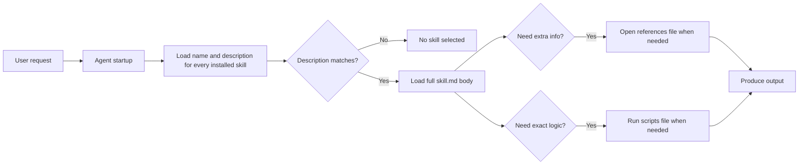

# Agent Skills Best Practices

This Wiki explains how to build reliable agent skills using `skill.md`, `references/`, and `scripts/`.

> **TL;DR:** The description decides whether a skill runs. The body should contain only what the model cannot infer. Use deterministic scripts for fragile steps. Vet third-party skills before running them.

Agent skills are a fast-moving open standard. More agentic platforms are adopting them, so best practices will continue to evolve.

## What is an agent skill?

An agent skill is a small package that teaches an agent how to perform a specific task.

A minimal skill folder looks like this:

```text
my-skill/
├── skill.md
├── references/
│   └── style-guide.md
└── scripts/
    └── calculate_totals.py
```

The `skill.md` file starts with YAML frontmatter:

```yaml
---
name: compliance-report
description: Generates the monthly compliance report from internal data. Use when asked for the compliance report, monthly filing, or regulatory summary.
---
```

## How skills are loaded

At startup, the agent cannot load every full skill without consuming too much context. It first loads only the `name` and `description` of each skill.

When a skill is selected, the agent then reads the rest of the `skill.md` body.



## The five best practices

| # | Best practice | Why it matters | Page |
|---|---------------|----------------|------|
| 1 | Write descriptions that trigger the skill | The agent only sees the description before running the skill | [1-Description-Trigger](1-Description-Trigger.md) |
| 2 | Build from real expertise | Generic LLM-generated instructions produce generic results | [2-Build-from-Real-Expertise](2-Build-from-Real-Expertise.md) |
| 3 | Spend context wisely | The body consumes context window space | [3-Spend-Context-Wisely](3-Spend-Context-Wisely.md) |
| 4 | Use deterministic scripts | Some steps must not be guessed | [4-Deterministic-Scripts](4-Deterministic-Scripts.md) |
| 5 | Vet before running | Skills can execute code and access secrets | [5-Vet-Before-Running](5-Vet-Before-Running.md) |

## Quick checklist

- [ ] Name is specific and under 64 characters
- [ ] Description says **what** the skill does and **when** to use it
- [ ] Description is under 1,024 characters
- [ ] Body includes gotchas from real use
- [ ] Body is lean, roughly under 500 lines / 5,000 tokens
- [ ] Large background material lives in `references/`
- [ ] Fragile steps are implemented in `scripts/`
- [ ] Third-party skill has been read and tested safely


